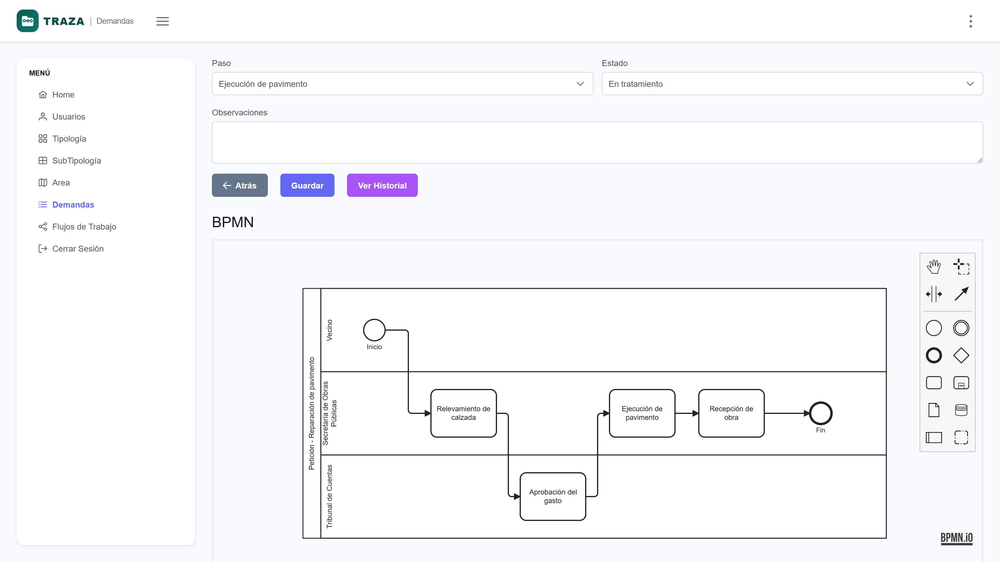

# gestor-expedientes-api

Backend de TRAZA, el sistema de mesa de entradas municipal: expedientes que avanzan por un circuito dibujado en BPMN, con traza de quién los movió y cuándo.

Frontend: [gestor-expedientes-web](https://github.com/Jmurga16/gestor-expedientes-web) · Demo: https://gestor-expedientesv1.azurewebsites.net


## Qué resuelve

Una municipalidad recibe pedidos, quejas y trámites de distinto tipo, y cada tipo recorre un circuito propio entre secretarías: relevamiento técnico, aprobación de presupuesto, ejecución, verificación. Ese circuito hoy suele vivir en la cabeza de quien atiende el mostrador.

Acá se dibuja una vez, en BPMN, con un carril por área. A partir de ahí cada expediente sabe por dónde tiene que pasar, y el listado de cada agente se arma solo: un referente de Obras Públicas ve los expedientes cuyo circuito tiene un carril de Obras Públicas.

## Cómo fluye un expediente

1. El administrador carga el catálogo: área, tipología, subtipología.
2. Dibuja un workflow en el modeler, le agrega un carril por área y lo asocia a una terna `(tipo de demanda, tipología, subtipología)`. La terna es única.
3. Se crea la demanda. El backend:
   - genera la carátula `NNN-TIPO-AAAA-SSSSS` con un contador atómico;
   - busca el workflow por la terna — si no existe devuelve `400` con `code=WORKFLOW_NOT_CONFIGURED`;
   - se queda con una copia propia del diagrama para ese expediente;
   - guarda en `idsArea` las áreas que tienen carril en ese diagrama, que es por donde filtran los listados;
   - registra la primera entrada del historial.
4. El administrador o el referente del área cambian paso, estado y observaciones. Cada cambio deja historial.
5. El expediente cierra cuando llega al paso `Finalizado`: desde ahí se le pueden corregir los datos, pero un intento de moverle el paso o el estado devuelve `400`.



## Roles

| Rol | Alcance sobre expedientes |
|---|---|
| `ROLE_ADMIN` | todos, y el ABM completo del catálogo y de usuarios |
| `ROLE_AREA` | los que tienen carril de su área, y puede avanzarlos |
| `ROLE_COLAB` | los de su área, sin cambiar paso ni estado |
| `ROLE_USER` | sólo los propios, sin avanzarlos |

El alcance se resuelve en la consulta a Mongo, no filtrando en memoria después. `JwtFilter` toma el email del token y relee el usuario de la base en cada request, así que un cambio de área o de rol aplica en la petición siguiente sin volver a loguearse.

El registro público (`/auth/create-user`) siempre da de alta con `ROLE_USER`. Los demás roles los asigna un administrador desde el ABM, incluido `ROLE_ADMIN`: en un municipio alguien tiene que poder nombrar a otro administrador. El usuario `id 1` está protegido y no se puede editar ni eliminar, para que la cuenta de administración de la demo no quede fuera de servicio.

## La decisión de diseño

Al crear un expediente, el `.bpmn` de la plantilla **se copia** a un blob propio de ese expediente.

Cuesta un blob por expediente y a cambio evita el problema clásico: si alguien edita la plantilla en marzo, los expedientes abiertos en enero siguen mostrando el circuito por el que realmente pasaron. La historia no se reescribe sola.

De esa copia salen además los pasos posibles: el front lee las `bpmn:Task` del diagrama y las ofrece en el desplegable "Paso", sin que haya que mantener una lista aparte en la base.

## Stack

Java 17 · Spring Boot 3.5 · Spring Security + JWT · MongoDB · Azure Blob Storage · Maven

## Estructura

Un paquete por agregado, cada uno con su `controller`, `service`, `repository`, `entity` y `dto`:

```
com.gestionexpedientes
├── area                 áreas/dependencias municipales
├── tipologia            clasificación del trámite
├── subtipologia
├── tipodemanda          catálogo fijo (enum), su código va en la carátula
├── workflow             plantilla BPMN + la terna que la identifica
├── demanda              el expediente
├── historial_demanda    traza de cambios de paso y estado
├── counter              secuencias atómicas (ids y carátulas)
├── file                 subida a blob y firma de SAS
├── security             JWT, filtros, rate limit de login
├── seed                 carga de datos demo (perfil `seed`)
└── global               DTOs, excepciones y utilidades comunes
```

## API

Todo pide `Authorization: Bearer <token>` salvo `/auth/**`.

| Método | Ruta | Quién |
|---|---|---|
| `POST` | `/auth/login` | público, con rate limit |
| `POST` | `/auth/create-user` | público, siempre alta como `usuario` |
| `GET` | `/user/me` | autenticado |
| `GET·POST·PUT·DELETE` | `/user` | admin |
| `GET·POST·PUT·DELETE` | `/area` `/tipologia` `/subtipologia` `/workflow` | admin |
| `GET` | `/area/activos` `/tipologia/activos` `/subtipologia/tipologia/{id}` `/tipo-demanda` | autenticado |
| `GET` | `/workflow/exists` | autenticado |
| `GET` | `/demanda` | autenticado, filtrado por rol |
| `GET` | `/demanda/export` | autenticado, `.xlsx` con el mismo alcance |
| `GET` | `/demanda/resumen` | autenticado, totales por estado |
| `GET·POST·PUT·DELETE` | `/demanda/{id}` | autenticado, con control de acceso por expediente |
| `GET` | `/historial-demanda/{idDemanda}` | autenticado |
| `POST` | `/file/{container}` | autenticado, 2 MB por archivo |
| `GET` | `/file/view` | autenticado, devuelve una SAS de 10 minutos |

## Levantarlo local

Hace falta JDK 17, una base MongoDB (local o Atlas) y una cuenta de Azure Blob Storage.

```bash
cp .env.example .env     # completar al menos las cuatro obligatorias
./mvnw spring-boot:run
```

La API queda en `http://localhost:8080`. El `.env` no se commitea; en Azure las mismas claves van en *Configuration → Application settings*.

### Variables

| Variable | Obligatoria | Default | Qué es |
|---|---|---|---|
| `MONGODB_URI` | sí | — | cadena de conexión de MongoDB |
| `MONGODB_DATABASE` | no | `db_expedientes` | base sobre la que trabaja |
| `JWT_SECRET` | sí | — | Base64URL de 32 bytes o más: `openssl rand -base64 48 \| tr '+/' '-_' \| tr -d '='` |
| `JWT_EXPIRATION` | no | `36000` | vigencia del token en segundos (10 h) |
| `AZURE_STORAGE_ACCOUNT_NAME` | sí | — | cuenta de Blob Storage |
| `AZURE_STORAGE_ACCOUNT_KEY` | sí | — | access key de esa cuenta |
| `CORS_ALLOWED_ORIGINS` | no | `localhost:4200` y la demo | orígenes del front, separados por coma |
| `LOGIN_MAX_ATTEMPTS` | no | `5` | fallos de login antes de bloquear la IP |
| `LOGIN_WINDOW_SECONDS` | no | `300` | ventana en la que se cuentan esos fallos |
| `LOGIN_BLOCK_SECONDS` | no | `900` | cuánto dura el bloqueo, que responde `429` |
| `UPLOAD_MAX_PER_WINDOW` | no | `10` | subidas permitidas por usuario |
| `UPLOAD_WINDOW_SECONDS` | no | `600` | ventana de esas subidas |
| `SEED_RESET` | no | `false` | con el perfil `seed`, recarga las colecciones que ya tienen datos |

Los dos rate limits viven en memoria: alcanzan para una instancia y se pierden al reiniciar.

### Datos de prueba

Catálogo, cuatro workflows con sus BPMN, usuarios de cada rol y expedientes con historial:

```bash
./mvnw spring-boot:run -Dspring-boot.run.profiles=seed
```

Corre, carga y se cierra sola. Salta las colecciones que ya tienen datos; con `SEED_RESET=true` las recarga. Crea los contenedores `workflow-bpmn` y `demanda-bpmn` si faltan y sube los `.bpmn` semilla; `demanda-imagen` hay que crearlo a mano antes de subir el primer adjunto. Los tres son privados: los archivos se sirven siempre con una SAS de 10 minutos por `/file/view`.

Las contraseñas demo están en `src/main/resources/seed/users.json`.

## Tests

```bash
./mvnw test
```

Cubren el control de acceso por rol y por área, el contador atómico, la firma y validación del JWT, el login, la exportación a Excel y el bloqueo de los expedientes finalizados.

## Despliegue

GitHub Actions publica en Azure App Service con cada push a `main`, autenticando por OIDC contra una identidad administrada — sin publish profile ni secretos de despliegue en el repo.
